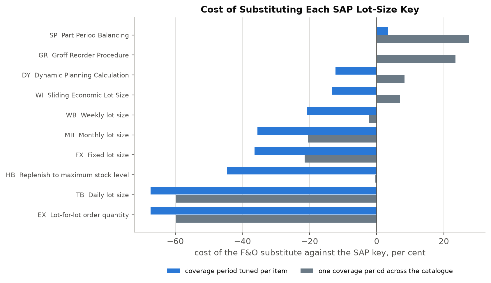

# Master planning in Dynamics 365 F&O and SAP S/4HANA

What an SAP lot-size key costs when it lands in F&O, and whether the family of lot-sizing procedures F&O does not have is worth asking for.

Supporting code for *Master planning (MRP) module in Dynamics 365 F&O and SAP S/4HANA*, published by CodeCore Dynamics.

---

## What this does

SAP groups lot sizing into three families: static, period and optimum. F&O has rules in the first two and nothing in the third. The optimum family reads a cost from the material master and chooses a lot size from it.

This repository reimplements both products' rules from their own documentation, replays two years of a real order book through all of them under rolling regeneration, and reports what the missing family is worth.

The headline is a positive result, and it went against the hypothesis. Under weekly replanning with forecast error, SAP's Part Period Balancing costs **8.8 to 29.2 per cent less** than the best rule F&O can express, in four of five business cases. It survives being told an order cost anywhere from half to twice the truth, moving 6.7 per cent.

The second result is the one that matters on a migration. Of ten SAP lot-size keys, only Part Period Balancing costs anything once the coverage period is set per item, and it costs 3.3 per cent. Leave one coverage period across the catalogue and the same key costs 27.6 per cent.



## The three families, and which product has what

| Family | SAP | Dynamics 365 F&O |
|---|---|---|
| Static | `EX` lot-for-lot, `FX` fixed lot size, `HB` replenish to maximum | `Per requirement`, `Min/Max`. No fixed lot size |
| Period | `TB` daily, `WB` weekly, `MB` monthly, posting period, planning calendar | `Per period`, in days |
| Optimum | `SP` Part Period Balancing, `WI` Sliding Economic Lot Size, `DY` Dynamic Planning Calculation, `GR` Groff Reorder Procedure | none |

SAP's period buckets are anchored to a calendar. F&O's are not: "The period starts with the first demand of the item and covers the defined length in time." SAP also chooses where in the bucket the receipt lands, at the start, the first requirement or the end. F&O has one position, and it is the best of the three.

## The gate

Four optimum procedures, one worked example, three distinct answers. SAP publishes the inputs and the result on each page, and this runs before anything else.

| Procedure | SAP publishes | This implementation |
|---|---|---|
| `SP` Part Period Balancing | 2000 | 2000 |
| `WI` Sliding Economic Lot Size | 2000 | 2000 |
| `DY` Dynamic Planning Calculation | 3000 | 3000 |
| `GR` Groff Reorder Procedure | 1000 | 1000 |

Groff also prints its two comparison figures, 1.79 against 19.18, and both reproduce. Those settle something SAP never states: the annual storage percentage is spread over **365** days. At 360 the figure is 19.44.

An identity check proves the code is self-consistent. A vendor's published arithmetic proves it implements the vendor's rule. Both run, in that order, in `sap_examples.py` and `selftest.py`.

### Structural identities

| Check | What it asserts |
|---|---|
| Wagner and Whitin bound | No feasible rule may cost less than the exact optimum |
| Unit bucket identity | A one day bucket must equal one order per requirement |
| Zero-noise identity | A calendar-anchored plan must not move on a perfect forecast |
| Receipt placement | All three placements move the same quantity, and only period-end drives projected on-hand negative |
| Long-term switch | The switch date lands on a period boundary at or after the raw count |
| Reproducibility | A rerun in a fresh process reproduces stored results exactly |

## Data

Two public files, both committed, so it runs as cloned.

**Online Retail II**, the transaction file of a UK non-store online retailer selling giftware, largely wholesale. 1,067,371 rows, 1 December 2009 to 9 December 2011. Published through the [UCI Machine Learning Repository](https://archive.ics.uci.edu/dataset/502/online+retail+ii) under CC BY 4.0. If it is missing for any reason, `run.py` downloads it.

This is the same file the companion Infor LN analysis used, deliberately. Same demand, same harness, one vendor swapped, so a difference in result is attributable to the rules and not to the data.

It also uses a column that analysis ignored. Every invoice line carries a unit price, so storage cost comes from what the firm charged. The median item sells at £2.10.

**ONS series J596**, the Retail Sales Index for non-store retailing, value not seasonally adjusted. Used once as an external check. `outputs.txt` should report a correlation of **0.858** between this firm's monthly revenue and the index, with both series peaking in November. If that is off, the date handling has shifted and nothing downstream is reliable.

## Running it

```bash
pip install -r requirements.txt
```

```bash
python run.py
```

The first run derives and caches a daily demand matrix and a median unit price per item from the workbook, so it is appreciably slower than later ones. A full run takes roughly half an hour. It writes `outputs.txt`, seven PNGs and the result CSVs into the working directory.

## Files

| File | Does |
|---|---|
| `config.py` | Every tunable value. No logic |
| `data.py` | Fetch, filter, classify, price |
| `engine.py` | F&O coverage codes, Wagner and Whitin as a bound, the cost function |
| `sap.py` | SAP's lot-sizing procedures, reimplemented from SAP Help Portal |
| `sap_examples.py` | The gate: SAP's published worked examples |
| `selftest.py` | The structural identities |
| `rolling.py` | Rolling regeneration: replan on a moving demand signal |
| `static.py` | Perfect foresight against the exact optimum, as a baseline |
| `sapcases.py` | Five business cases, and the order-cost misspecification test |
| `placement.py` | Anchoring against receipt placement, as a two-way design |
| `tuning.py` | What tuning the coverage period is worth, and which rule to use |
| `mapping.py` | What each SAP lot-size key costs when substituted in F&O |
| `stability.py` | Plan stability under two tolerances |
| `external.py` | The ONS check |
| `report_sap.py` | Builds `outputs.txt`, one function per section |
| `figures/sap_figs.py` | One function per figure |

## Two places the documentation does not settle the answer

**Groff's stop rule.** SAP publishes one worked example, and its single step makes the number of periods covered equal the candidate's day offset. Two readings of the rule both reproduce it. On real demand they differ by a factor of two to three: the published stop rule costs 1.12 to 1.53 times the Wagner and Whitin optimum, and reading both sides literally off the printed table costs 1.42 to 3.83. The published stop rule is the default, on three grounds. SAP names the procedure after Groff, the literal reading leaves `GR` dominated by `SP` at every order cost tested, and Groff (1979) and Zoller and Robrade (1988) define it the first way. Both are implemented and both are asserted against the example, so the gate passing is not mistaken for the question being closed.

**Where the period-end receipt leaves dependent demand.** SAP reschedules "the basic dates of the planned order ... as well as the dependent requirements for the components". This replay is single level, so the independent demand it covers stays where it is. The fill rate loss measured here is therefore an upper bound on what the setting costs in a multi-level bill.

## Parameters that are judgement, not derivation

Each is a choice. Moving any of them moves some conclusion.

| Parameter | Value | Where |
|---|---|---|
| Annual storage cost, per cent of price | 20 | `config.STORAGE_PCT` |
| Order cost, and the sweep | 1, over 0.25 to 50 | `config.ORDER_COST`, `config.ORDER_COST_SWEEP` |
| Misspecification factors | 0.5, 2.0 | `config.MISSPECIFY` |
| Storage days per year | 365 | `sap.STORAGE_DAYS_PER_YEAR` |
| Service floor for any cost ranking | 95 per cent | `report_sap.FLOOR` |
| Groff reading | published stop rule | `sap.GROFF_DEFAULT` |
| Replan cadence | 7 days | `config.REPLAN_EVERY` |
| Firm demand visibility | 28 days | `config.VISIBILITY_DAYS` |
| Opening stock | 14 days of mean demand | `config.OPENING_STOCK_DAYS` |
| Demand classification cutoffs | ADI 1.32, CV² 0.49 | `config.ADI_CUT`, `config.CV2_CUT` |
| Activity filter | 12 demand days, 180 day window | `config.MIN_DEMAND_DAYS`, `config.MIN_ACTIVE_DAYS` |
| Business case lead times and forecast errors | see table | `config.CASES` |

The order cost is the one everything rests on, and nothing in the data sets it. The sweep is calibrated against what it implies: at each value the EOQ-implied cycle has a median of 18, 35, 79, 136 and 248 days. At a fully loaded purchase order cost of £50, 98 per cent of items imply a cycle longer than any coverage period tested, because a £50 order against £3 a day of demand should be raised rarely. Real wholesalers consolidate many items onto one order, which is a problem neither product's single-item lot sizing addresses.

## What is measured, and what is not

Cost here is order cost plus storage cost. It is what the optimum procedures minimise, so it is what they are judged on, but it cannot see a stockout. `Min/Max` was cheapest in two business cases while serving 83 to 84 per cent of demand. Every ranking is taken among rules clearing a 95 per cent fill rate, which is also what the lot-sizing literature assumes, since it does not allow backlogging.

Plan stability is computed and **no claim rests on it**. The rule was fixed before the run: publishable only if it holds under both an absolute and a relative tolerance. Under the order-level measure the two disagree on which rule is most stable and move ranks by five places, so nothing is published. SAP's planning time fence and firming types exist to dampen exactly this, and this method cannot price them.

Nothing here is a comparison against **PP/DS**, which plans with capacity and cost constraints this model does not carry. The claim is bounded to the lot-sizing procedures on the MRP 1 view. The SAP side is S/4HANA 2025, on-premise and private cloud; the public cloud edition is not covered.

No SAP system and no F&O system was run. Both rule sets are reimplementations of documented behaviour, and a behaviour differing from the documentation is invisible to this method.

## Known limits

This is a wholesaler's order book. It carries no bills of material, no routings and no capacity, so nothing here tests dependent demand, multi-level netting or capacity scheduling. That bounds the findings to purchasing and distribution, which is where the lot-sizing literature places uncapacitated results.

No safety stock is modelled. The period-end fill rate losses are therefore an upper bound, since a real implementation carrying a long lead time would buffer them.

The hindsight column in the tuning results picks each item's best coverage period knowing the outcome. It is a bound, not a method, and it is labelled as one. The two rules a planner could actually apply are reported beside it, and one of them fails.

## On method

The analysis code and the initial draft were produced with Claude Code. The dataset and the configuration claims were verified against the vendors' published documentation before publication. The code is public, so the analysis can be checked.

## Licence

MIT. See `LICENSE`.
